# CARLA 車両寸法一覧 (CARLA 0.9.15)

Vissim 車両タイプ → CARLA ブループリントの割り当て (`vissim_integration/data/vtypes.json`) を検討するための、CARLA 標準車両の寸法一覧。

## 測定方法

- 対象: `world.get_blueprint_library().filter('vehicle.*')` の全 41 ブループリント
- 各ブループリントを 1 台ずつスポーンし、`actor.bounding_box.extent` の 2 倍を寸法とした (単位: m)
  - バウンディングボックス値のため、実車諸元とは一致しない場合がある (特に二輪車・自転車)
- `base_type` / `wheels` はブループリント属性 `base_type` / `number_of_wheels` の値
- 画像は公式車両カタログ (https://carla.readthedocs.io/en/0.9.15/catalogue_vehicles/) の画像 (1920x1080) から車両部分をトリミングしたもの (`img/carla_vehicles/`, 高さ 336px に統一)
- 実行コマンド (`~/CARLA/Co-Simulation/PTV-Vissim/util` で実行)

```bash
python3 carla_vehicle_dimensions.py --host localhost --port 2000 --csv carla_vehicle_dims.csv
```

## 寸法一覧 (base_type 別・車長順)

「vtypes.json」列は現在の割り当て先 Vissim 車両タイプ。

### car (乗用車)

| 画像 | ブループリント | base_type | 車輪数 | 車長 | 車幅 | 車高 | vtypes.json |
|---|---|---|---:|---:|---:|---:|---|
| 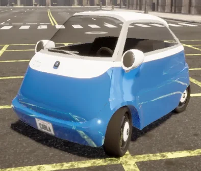 | vehicle.micro.microlino | car | 4 | 2.21 | 1.48 | 1.38 | |
| 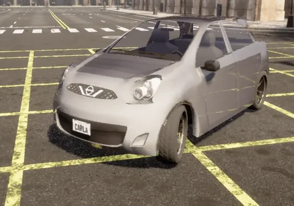 | vehicle.nissan.micra | car | 4 | 3.63 | 1.85 | 1.50 | 100 |
| 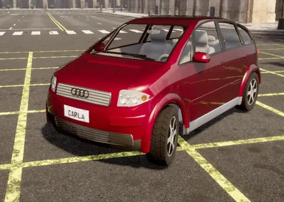 | vehicle.audi.a2 | car | 4 | 3.71 | 1.79 | 1.55 | 100 |
| 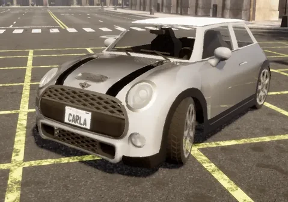 | vehicle.mini.cooper_s | (未設定) | 4 | 3.81 | 1.97 | 1.48 | 100 |
| 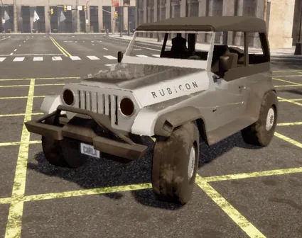 | vehicle.jeep.wrangler_rubicon | car | 4 | 3.87 | 1.91 | 1.88 | 100 |
| 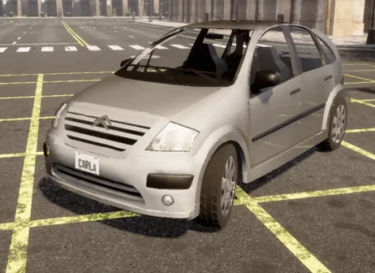 | vehicle.citroen.c3 | car | 4 | 3.99 | 1.85 | 1.62 | 100 |
| 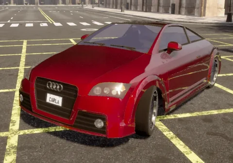 | vehicle.audi.tt | car | 4 | 4.18 | 1.99 | 1.39 | 100 |
| 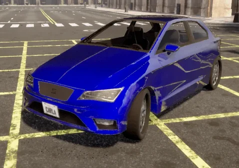 | vehicle.seat.leon | car | 4 | 4.19 | 1.82 | 1.47 | 100 |
| 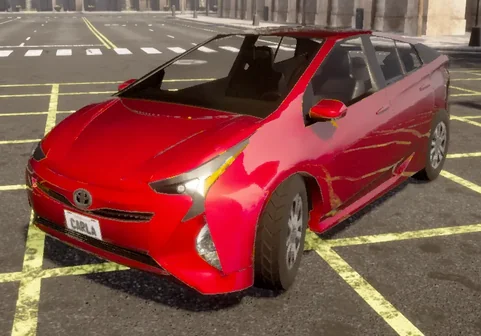 | vehicle.toyota.prius | car | 4 | 4.51 | 2.01 | 1.52 | 100 |
| 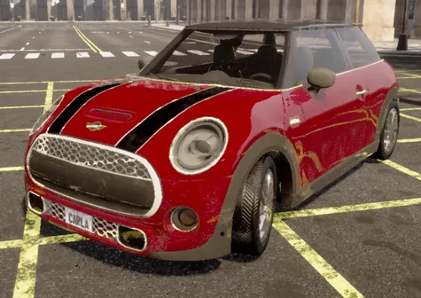 | vehicle.mini.cooper_s_2021 | car | 4 | 4.55 | 2.10 | 1.77 | |
| 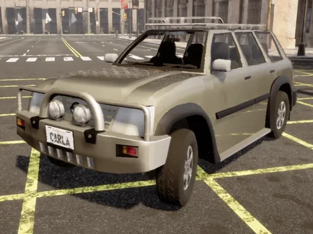 | vehicle.nissan.patrol | car | 4 | 4.60 | 1.93 | 1.85 | 100 |
| 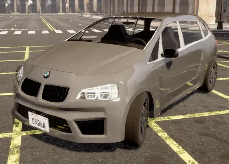 | vehicle.bmw.grandtourer | (未設定) | 4 | 4.61 | 2.24 | 1.67 | 100 |
| 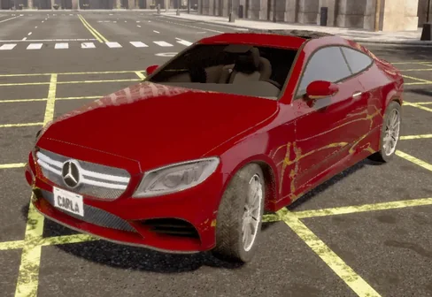 | vehicle.mercedes.coupe_2020 | car | 4 | 4.67 | 1.81 | 1.44 | |
| 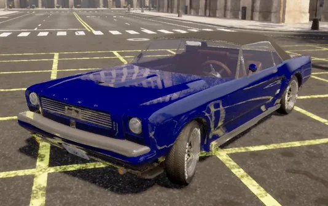 | vehicle.ford.mustang | car | 4 | 4.72 | 1.89 | 1.30 | 100 |
| 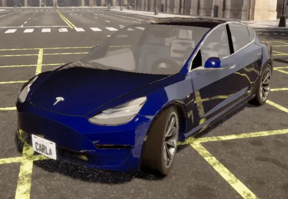 | vehicle.tesla.model3 | car | 4 | 4.79 | 2.16 | 1.49 | 100 |
| 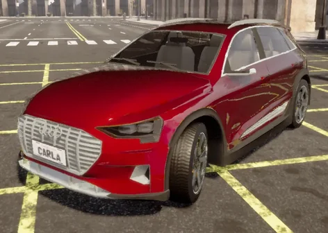 | vehicle.audi.etron | car | 4 | 4.86 | 2.03 | 1.65 | 100 |
| 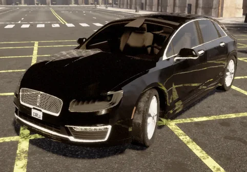 | vehicle.lincoln.mkz_2020 | car | 4 | 4.89 | 1.84 | 1.49 | |
| 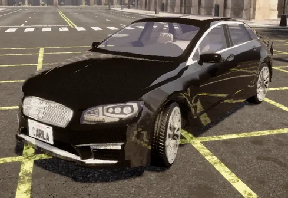 | vehicle.lincoln.mkz_2017 | car | 4 | 4.90 | 2.13 | 1.51 | 100 |
| 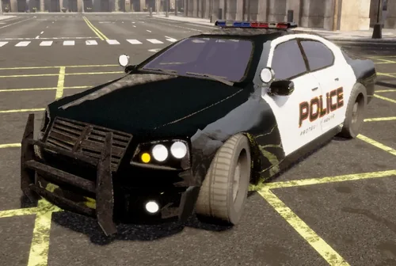 | vehicle.dodge.charger_police | car | 4 | 4.97 | 2.04 | 1.54 | |
| 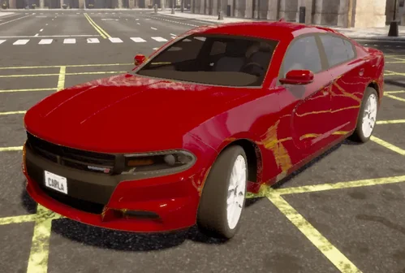 | vehicle.dodge.charger_2020 | car | 4 | 5.01 | 1.88 | 1.53 | |
| 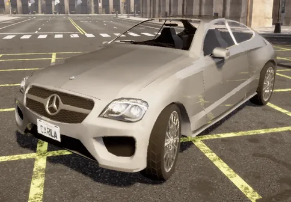 | vehicle.mercedes.coupe | car | 4 | 5.03 | 2.15 | 1.65 | 100 |
| 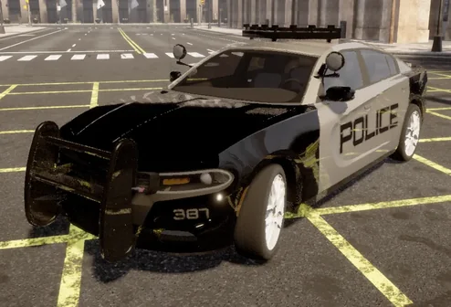 | vehicle.dodge.charger_police_2020 | car | 4 | 5.24 | 1.93 | 1.64 | |
| 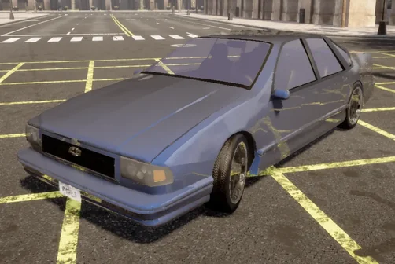 | vehicle.chevrolet.impala | car | 4 | 5.36 | 2.03 | 1.41 | |
| 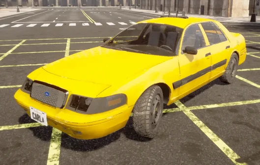 | vehicle.ford.crown | car | 4 | 5.37 | 1.80 | 1.57 | |
| 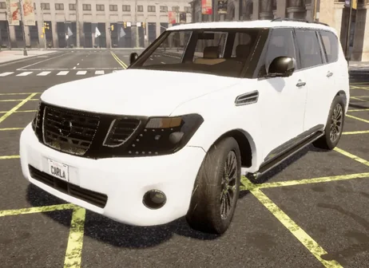 | vehicle.nissan.patrol_2021 | car | 4 | 5.57 | 2.15 | 2.05 | |

### van (バン)

| 画像 | ブループリント | base_type | 車輪数 | 車長 | 車幅 | 車高 | vtypes.json |
|---|---|---|---:|---:|---:|---:|---|
| 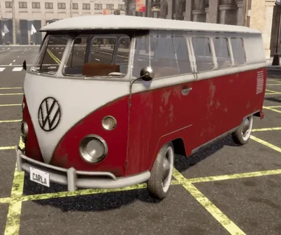 | vehicle.volkswagen.t2_2021 | van | 4 | 4.44 | 1.77 | 1.99 | |
| 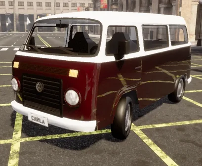 | vehicle.volkswagen.t2 | van | 4 | 4.48 | 2.07 | 2.04 | 100 |
| 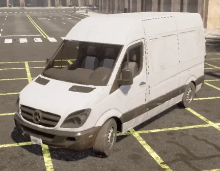 | vehicle.mercedes.sprinter | van | 4 | 5.92 | 1.99 | 2.56 | |
| 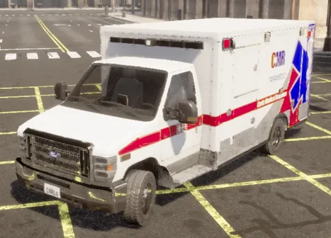 | vehicle.ford.ambulance | van | 4 | 6.37 | 2.35 | 2.43 | |

### truck (トラック)

| 画像 | ブループリント | base_type | 車輪数 | 車長 | 車幅 | 車高 | vtypes.json |
|---|---|---|---:|---:|---:|---:|---|
| 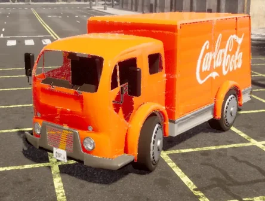 | vehicle.carlamotors.carlacola | truck | 4 | 5.20 | 2.63 | 2.47 | 200 |
| 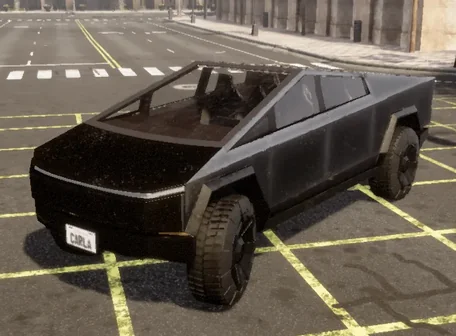 | vehicle.tesla.cybertruck | truck | 4 | 6.27 | 2.39 | 2.10 | |
| 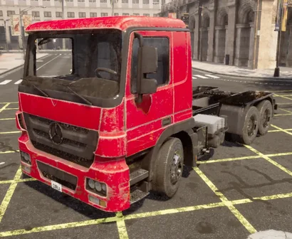 | vehicle.carlamotors.european_hgv | truck | 6 | 7.94 | 2.89 | 3.46 | |
| 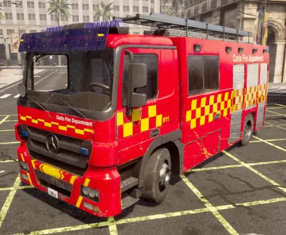 | vehicle.carlamotors.firetruck | truck | 4 | 8.47 | 2.89 | 3.83 | |

### Bus (バス)

| 画像 | ブループリント | base_type | 車輪数 | 車長 | 車幅 | 車高 | vtypes.json |
|---|---|---|---:|---:|---:|---:|---|
| 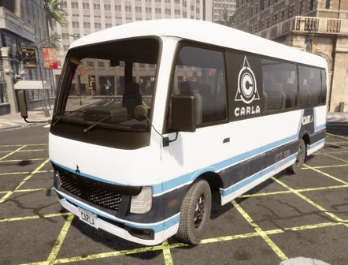 | vehicle.mitsubishi.fusorosa | Bus | 4 | 10.27 | 3.94 | 4.25 | |

### motorcycle (自動二輪)

| 画像 | ブループリント | base_type | 車輪数 | 車長 | 車幅 | 車高 | vtypes.json |
|---|---|---|---:|---:|---:|---:|---|
|  | vehicle.vespa.zx125 | motorcycle | 2 | 1.82 | 0.87 | 1.59 | |
| 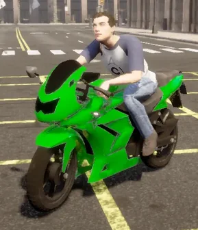 | vehicle.kawasaki.ninja | motorcycle | 2 | 2.04 | 0.80 | 1.52 | 610, 620 |
| 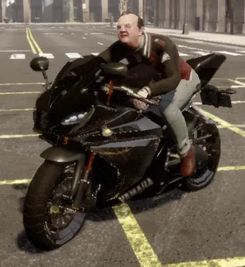 | vehicle.yamaha.yzf | motorcycle | 2 | 2.19 | 0.87 | 1.53 | 610, 620 |
| 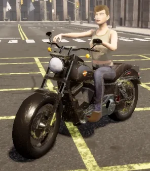 | vehicle.harley-davidson.low_rider | motorcycle | 2 | 2.35 | 0.77 | 1.65 | 610, 620 |

### bicycle (自転車)

| 画像 | ブループリント | base_type | 車輪数 | 車長 | 車幅 | 車高 | vtypes.json |
|---|---|---|---:|---:|---:|---:|---|
| 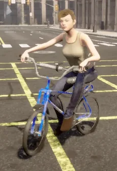 | vehicle.bh.crossbike | bicycle | 2 | 1.51 | 0.87 | 1.61 | 610, 620 |
|  | vehicle.diamondback.century | bicycle | 2 | 1.66 | 0.58 | 1.62 | 610, 620 |
|  | vehicle.gazelle.omafiets | bicycle | 2 | 1.84 | 0.66 | 1.78 | 610, 620 |

## 備考

- `vehicle.bmw.grandtourer` と `vehicle.mini.cooper_s` は `base_type` 属性が空。
- `vehicle.mitsubishi.fusorosa` の `base_type` は大文字始まりの `Bus` (他は小文字)。
- `vehicle.carlamotors.european_hgv` のみ 6 輪。
- 現在の `vtypes.json` の 610 / 620 には自動二輪と自転車が混在している。
