# Vissim 車両寸法一覧 (odaiba_v015.inpx)

Vissim 車両タイプ → CARLA ブループリントの割り当て (`vissim_integration/data/vtypes.json`) を検討するための、Vissim 側の車両 (2D/3D モデル) の寸法一覧。CARLA 側は [CARLA_車両寸法一覧.md](CARLA_車両寸法一覧.md) を参照。

## 抽出方法

- 対象ファイル: `odaiba_v015.inpx` (Vissim ネットワークファイル, `network version="1403"`)
- 対象車両タイプ: 100 / 210 / 220 / 300 / 700 (co-sim で使用する車両タイプ。190 LGV / 200 HGV は対象外)
- inpx (XML) の以下の要素から抽出した
  - `vehicleTypes/vehicleType`: 車両タイプ番号・名前・カテゴリ・`model2D3DDistr` (2D/3D モデル分布)
  - `vehicleClasses/vehicleClass`: 車両クラス
  - `model2D3DDistributions/model2D3DDistribution`: モデルごとの `share`
  - `models2D3D/model2D3D/model2D3DSegs/model2D3DSegment`: `length` / `width` / `height` / `file3D`
- 寸法の単位は m (小数第 3 位を四捨五入)
  - 車幅は 3D モデルの外形から求まる値のため、ミラーを含むとみられ、実車諸元より大きめ (例: Golf 2.06 m)
  - 複数セグメント (連結車) の車長は、前セグメントの `jointRear` に後セグメントの `jointFront` を合わせて連結したときの全長。車幅・車高は各セグメントの最大値
- 画像は車両タイプ設定資料 (`20260929_ウームアップ/temp.pptx`) に貼付された 3D モデル画像 (`img/vissim_vehicles/`, 高さ 336px に統一)

## 車両タイプ一覧

| 車両タイプ | 車両クラス | カテゴリ | 2D/3D モデル分布 | モデル数 |
|---|---|---|---|---:|
| 100: 自動車 | 10: 自動車 | CAR | 10: 自動車 | 10 |
| 210: トラック | 21: トラック | HGV | 21: トラック | 1 |
| 220: トレーラー | 22: トレーラー | HGV | 22: トレーラー | 1 |
| 300: バス | 30: バス | BUS | 30: バス | 1 |
| 700: 自動二輪 | 70: 自動二輪 | BIKE | 61: 自転車 男性 (※) | 1 |

※ 700 の分布については [備考](#備考) を参照。

## 寸法一覧 (車両タイプ別・車長順)

### 100: 自動車

| 画像 | 2D/3D モデル | シェア | 車長 | 車幅 | 車高 | 3D モデルファイル |
|---|---|---:|---:|---:|---:|---|
| 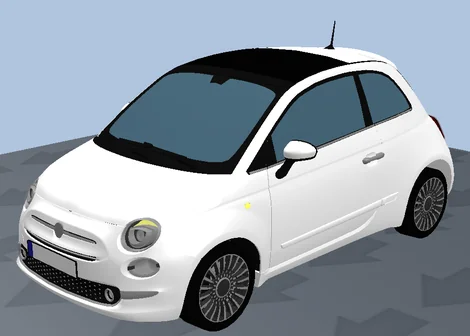 | 1: Car - Fiat 500 | 0.06 | 3.56 | 1.88 | 1.67 | Car - Fiat 500 (2018).u3dm |
| 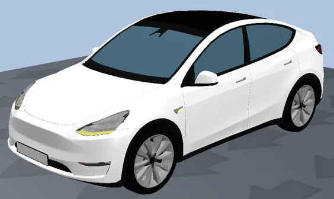 | 2: Car - Tesla Model Y | 0.05 | 4.20 | 1.91 | 1.47 | Car - Tesla Model Y (2022).u3dm |
| 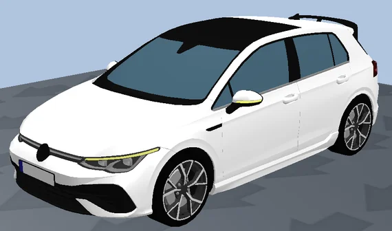 | 3: Car - Volkswagen Golf | 0.18 | 4.32 | 2.06 | 1.48 | Car - Volkswagen Golf VIII (2022).u3dm |
| 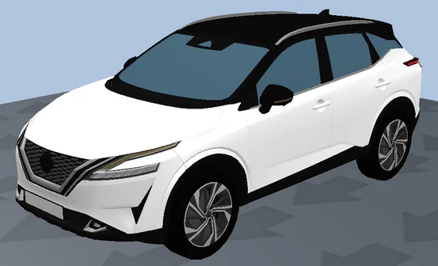 | 8: SUV - Nissan Qashqai | 0.07 | 4.33 | 1.99 | 1.63 | SUV - Nissan Qashqai (2022).u3dm |
| 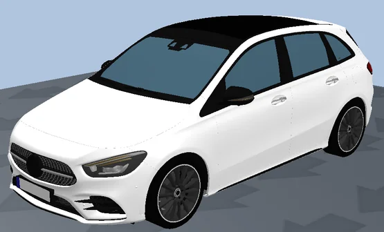 | 4: Car - Mercedes B Class | 0.11 | 4.41 | 2.05 | 1.55 | Car - Mercedes B Class (2021).u3dm |
| 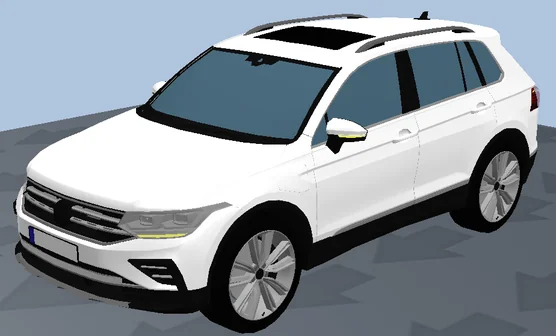 | 9: SUV - Volkswagen Tiguan | 0.18 | 4.50 | 2.11 | 1.67 | SUV - Volkswagen Tiguan eHybrid (2022).u3dm |
| 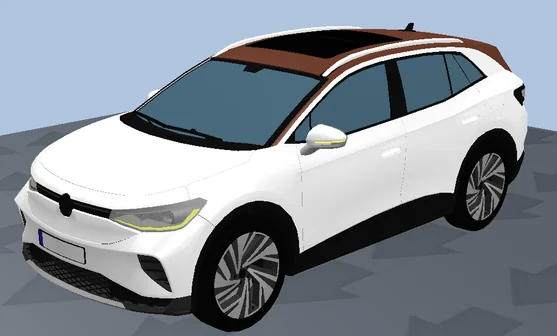 | 10: SUV - Volkswagen ID 4 | 0.05 | 4.59 | 2.04 | 1.66 | SUV - Volkswagen ID 4 (2022).u3dm |
| 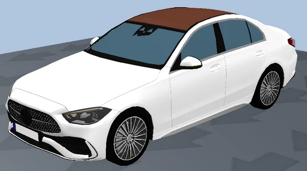 | 5: Car - Mercedes C Class | 0.14 | 4.75 | 2.03 | 1.44 | Car - Mercedes C Class (2021).u3dm |
| 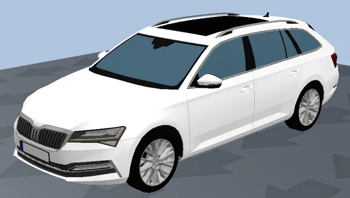 | 6: Car - Skoda Superb Combi | 0.05 | 4.78 | 2.02 | 1.47 | Car - Skoda Superb Combi (2022).u3dm |
| 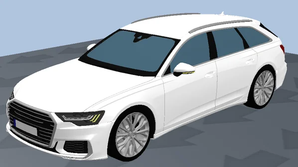 | 7: Car - Audi A6 | 0.11 | 4.99 | 2.12 | 1.48 | Car - Audi A6 Avant (2021).u3dm |

### 210: トラック

| 画像 | 2D/3D モデル | シェア | 車長 | 車幅 | 車高 | 3D モデルファイル |
|---|---|---:|---:|---:|---:|---|
| 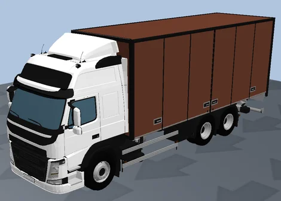 | 21: HGV - Tractor Box Volvo | 1 | 10.26 | 2.30 | 4.01 | HGV - Tractor Box Volvo FM 370.u3dm |

### 220: トレーラー

| 画像 | 2D/3D モデル | シェア | 車長 | 車幅 | 車高 | 3D モデルファイル |
|---|---|---:|---:|---:|---:|---|
| 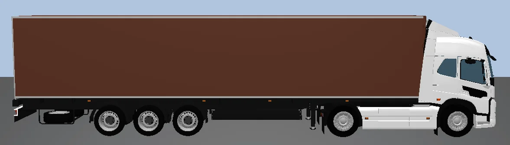 | 22: HGV - Semi-Tractor Volvo E + Semi-Trailer Box 3-axles | 1 | 16.50 | 2.55 | 4.01 | (下記 2 セグメント) |

セグメント内訳:

| セグメント | 車長 | 車幅 | 車高 | jointFront | jointRear | 3D モデルファイル |
|---|---:|---:|---:|---:|---:|---|
| 1: トラクター | 5.96 | 2.55 | 3.60 | 1.44 | 4.41 | HGV - Semi-Tractor Volvo E (2019).u3dm |
| 2: トレーラー | 14.14 | 2.30 | 4.01 | 2.05 | 13.80 | HGV - Semi-Trailer Box 3-axles.u3dm |

全長 = 4.41 − 2.05 + 14.14 = 16.50 m (トレーラー前端はトラクター前端から 2.36 m 後方)

### 300: バス

| 画像 | 2D/3D モデル | シェア | 車長 | 車幅 | 車高 | 3D モデルファイル |
|---|---|---:|---:|---:|---:|---|
| 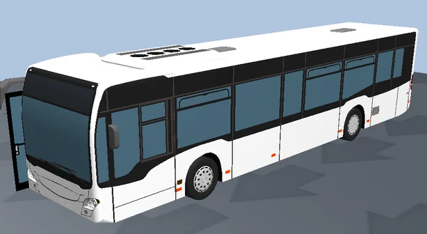 | 31: Bus - C2 Standard | 1 | 12.14 | 2.55 | 3.12 | Bus - C2 Standard 2-doors.fbx |

### 700: 自動二輪

inpx の設定 (分布 61: 自転車 男性):

| 画像 | 2D/3D モデル | シェア | 車長 | 車幅 | 車高 | 3D モデルファイル |
|---|---|---:|---:|---:|---:|---|
| — | 61: Bike - Cycle Man | 1 | 1.77 | 0.63 | 1.74 | Bike - Cycle Man 02.fbx |

参考: 分布 300「自動二輪」(どの車両タイプにも未割り当て):

| 画像 | 2D/3D モデル | シェア | 車長 | 車幅 | 車高 | 3D モデルファイル |
|---|---|---:|---:|---:|---:|---|
| 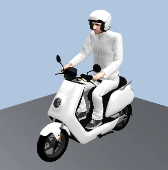 | 303: Bike - Scooter electric NIU NQi | 0.1 | 1.81 | 0.78 | 1.80 | Bike - Scooter electric NIU NQi (2023) - 01.u3dm |
| 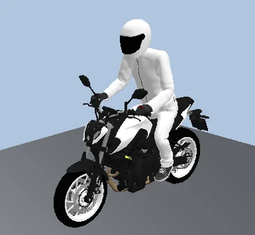 | 302: Bike - Motorbike Yamaha MT 07 | 1 | 2.10 | 0.91 | 1.86 | Bike - Motorbike Yamaha MT 07 (2022).u3dm |

## 備考

- 車両タイプ 700 (自動二輪) の `model2D3DDistr` は 61「自転車 男性」(Bike - Cycle Man) を指しており、自動二輪モデル (Yamaha MT 07 / NIU NQi) を含む分布 300「自動二輪」は未使用。設定資料 (temp.pptx) では 700 に Yamaha MT 07 / NIU NQi を各 0.5 で割り当てる想定のため、inpx の設定漏れの可能性がある。
- 分布 300 のシェアは Yamaha MT 07 = 1、NIU NQi = 0.1 (相対シェアとして扱われる場合は約 91% : 9%)。設定資料の 0.5 / 0.5 とは異なる。
- 100: 自動車のシェア合計は 1.00。
- 210: トラックの 3D モデル (HGV - Tractor Box Volvo) は単一セグメント (リジッドトラック)、220: トレーラーはトラクター + セミトレーラーの 2 セグメント連結車。
